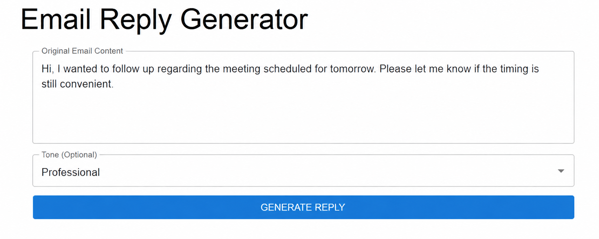

# Smart Email Assistant

> Write less. Reply better.

Smart Email Assistant is a lightweight AI-powered web application that helps you generate email replies based on the content of an email and the tone you want.

Instead of starting every reply from scratch, paste the email, choose a tone, and let the assistant create a response you can refine and use.

<p align="center">
  
</p>

---

## ✨ Why I Built This

Writing a simple email reply can sometimes take more time than it should.

I wanted to build a small, practical application that combines a **React frontend**, **Spring Boot backend**, and **Gemini API** into one complete workflow.

The project also gave me hands-on experience with:

- Building a React interface
- Creating REST APIs with Spring Boot
- Connecting frontend and backend applications
- Working with external AI APIs
- Handling JSON requests and responses
- Managing API credentials with environment variables
- Using Git and GitHub for project development

---

## 🚀 What It Does

The workflow is intentionally simple:

**1. Paste**  
Add the email you received.

**2. Choose**  
Select the tone you want for your response.

**3. Generate**  
The application sends the request to the backend.

**4. Reply**  
Gemini generates a context-aware email response.

### Available tones

- Professional
- Friendly
- Formal
- Casual

---

## 🧩 How It Works

```text
┌──────────────────────┐
│        User          │
│  Email + Tone        │
└──────────┬───────────┘
           │
           ▼
┌──────────────────────┐
│    React Frontend    │
│   Vite + MUI + Axios │
└──────────┬───────────┘
           │
           │ POST /api/email/generate
           ▼
┌──────────────────────┐
│   Spring Boot API    │
│      WebClient       │
└──────────┬───────────┘
           │
           ▼
┌──────────────────────┐
│     Gemini API       │
│   Generate Reply     │
└──────────┬───────────┘
           │
           ▼
┌──────────────────────┐
│   Generated Reply    │
│    → Frontend        │
└──────────────────────┘
